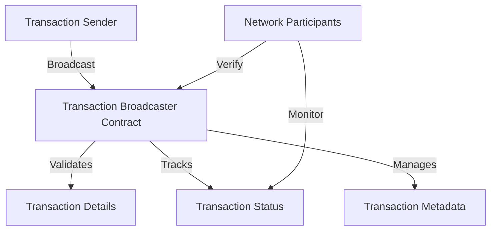

# Broadcast Transaction

A robust, decentralized transaction broadcasting smart contract for efficient and secure transaction propagation on the Stacks blockchain.

## Overview

Broadcast Transaction is a blockchain-based platform designed to provide:
- Secure transaction broadcasting mechanism
- Verifiable transaction tracking
- Flexible transaction management
- Decentralized transaction propagation
- Immutable transaction history

The platform ensures reliable and transparent transaction handling in a trustless blockchain environment.

## Architecture

The system is built around a primary smart contract that manages:



### Core Components:
- Transaction Validation
- Status Tracking
- Metadata Management
- Broadcast Confirmation
- Transaction Verification

## Contract Documentation

### transaction-broadcaster.clar

The primary contract handling transaction broadcasting functionality.

#### Key Features:
- Secure transaction broadcasting
- Transaction status tracking
- Validation mechanisms
- Transparent transaction propagation

#### Transaction States:
- `TRANSACTION-PENDING`: Initial transaction state
- `TRANSACTION-CONFIRMED`: Successfully broadcast
- `TRANSACTION-FAILED`: Broadcast unsuccessful

## Getting Started

### Prerequisites
- Clarinet
- Stacks wallet for deployment/interaction

### Basic Usage

1. Broadcast a transaction:
```clarity
(contract-call? .transaction-broadcaster broadcast-transaction 
    "unique-tx-id"
    tx-sender
    0x123456... ;; transaction payload
)
```

2. Check transaction status:
```clarity
(contract-call? .transaction-broadcaster get-transaction-status "unique-tx-id")
```

## Function Reference

### Public Functions

#### Transaction Management
- `broadcast-transaction`: Submit a new transaction
- `get-transaction-status`: Retrieve transaction status
- `verify-transaction`: Verify transaction details

#### Tracking
- `list-transactions`: List recent transactions
- `get-transaction-details`: Retrieve comprehensive transaction information

## Development

### Testing
1. Clone the repository
2. Install Clarinet
3. Run tests:
```bash
clarinet test
```

### Local Development
1. Start Clarinet console:
```bash
clarinet console
```
2. Deploy contracts:
```clarity
(contract-call? .transaction-broadcaster ...)
```

## Security Considerations

### Transaction Validation
- Transaction integrity checks
- Prevent duplicate broadcasts
- Validate transaction metadata
- Secure transaction tracking

### Limitations
- On-chain transaction tracking
- Limited to metadata and status
- Actual transaction execution occurs off-chain
- Requires proper transaction construction